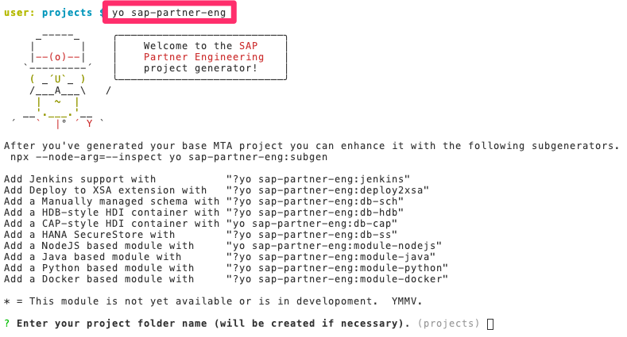

# Yeoman Recipe for the project sample

## Yeoman is installed in the Business Application Studio or install it locally with..
```
npm install -g yo
```

## Install this exact version of the partner engineering yeoman generator

```
npm install -g generator-sap-partner-eng@0.3.6
```

## Verify generator version (if already installed)

```
npm ls -g --depth=0 generator-sap-partner-eng
```

    generator-sap-partner-eng@0.3.6

## Run the yeoman generator to create the project folder and approuter
**Note:** The answers given below were the ones used to create this sample code repository.  You may use your own component/file naming convention to make it easier to integrate this code the generated code into your project.


```
yo sap-partner-eng
```



Continue answering the prompts.
```
? Enter your project folder name (will be created if necessary). cloud-cap-multitenancy
? Enter your project application name (will be used for defaults). capmt
? Enter your project application description. Cloud Application Programming(CAP) with Multitenancy using Service Manger Tenant Data Separation
? Application router internal module name. capmt-app
This list of domain names is based on the current 'cf domains' command.
 Domain name. cfapps.us10.hana.ondemand.com
? Application router path app
? Domain/Database model path db
? Services definition path srv
? UAA resource name capmt-uaa
? UAA service name CAPMT_UAA
...
```
Change into the folder just created and continue.
```
cd cloud-cap-multitenancy
```
## Run the yeoman db-cap sub-generator to create the db and srv folders and files


Now from within the project folder run the sub-generator for db-cap with this command.
```
yo sap-partner-eng:db-cap
```
Continue answering the prompts.
```
Start Prompting.
What is: foo!
Using app_name: capmt
Using router_name: capmt-app
Using router_path: app
Using database_path: db
Using services_path: srv
? DB Module Name. capmt-hdb
Leave this blank if you want the system to generate the schema name.
 DB Schema Name. 
? HDI resource name capmt-hdi
Implement the service module as nodejs/(java) module type.
 Module type. nodejs
? HDI service name. CAPMT_HDI
? Services Module Name. capmt-srv
? Services Module API (Internal Reference). capmt_svc_api
? Services Module Back End (AppRouter Destination). capmt_svc_be
? Route path(after first /) that your module will handle catalog
? Use this NodeJS module to handle CDS-MTX style subscription requests? Yes
? Registry Resource Name. capmt-reg
? Registry Service Name. CAPMT_REG
? Managed(HDI) Resource Name. capmt-smc
? Managed(HDI) Service Name. CAPMT_SMC
Using domain_name: cfapps.us10.hana.ondemand.com
Using uaa_res_name: capmt-uaa
    force .yo-rc.json
   create db/.build.js
   create db/data-model.cds
   ...
   create srv/package.json
 conflict mta.yaml
? Overwrite mta.yaml? (Answer "a" for Overwrite all)
    force mta.yaml
    force app/xs-app.json
    force app/resources/index.html
```
